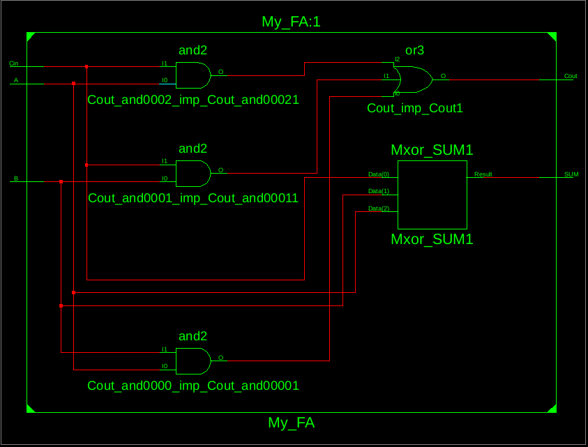
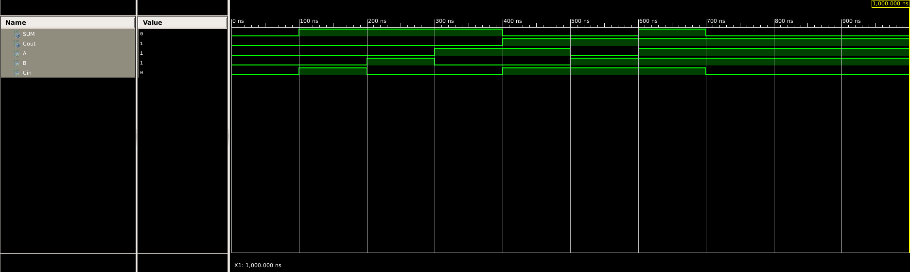
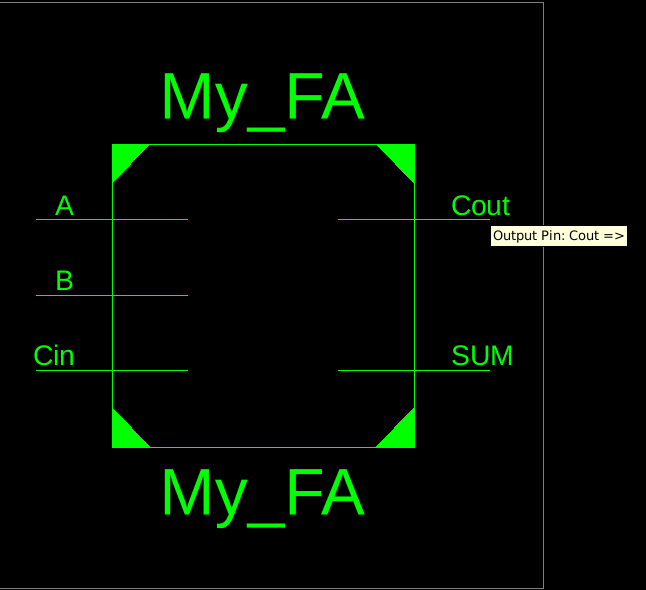

# ⚙️ Verilog Full Adder

This project demonstrates the **implementation of a 1-bit Full Adder** using **three Verilog modeling styles**: Gate-level, Dataflow, and Behavioral. It also includes corresponding **testbenches** to verify the correctness of each model.

---

## 📘 Project Overview

A **Full Adder** is a fundamental combinational circuit that adds three one-bit binary numbers — `A`, `B`, and `Cin` — and outputs a **Sum** and **Carry (Cout)**.

### ➕ Boolean Equations

```
Sum  = A ⊕ B ⊕ Cin
Cout = (A & B) | (B & Cin) | (A & Cin)
```

### 📊 Truth Table

| A | B | Cin | Sum | Cout |
| - | - | --- | --- | ---- |
| 0 | 0 | 0   | 0   | 0    |
| 0 | 0 | 1   | 1   | 0    |
| 0 | 1 | 0   | 1   | 0    |
| 0 | 1 | 1   | 0   | 1    |
| 1 | 0 | 0   | 1   | 0    |
| 1 | 0 | 1   | 0   | 1    |
| 1 | 1 | 0   | 0   | 1    |
| 1 | 1 | 1   | 1   | 1    |

---

## 🧩 Design Methodology

### 1️⃣ Gate-Level Modeling

```verilog
module full_adder_gate (
  input A, B, Cin,
  output Sum, Cout
);
  wire w1, w2, w3;

  xor (w1, A, B);
  xor (Sum, w1, Cin);
  and (w2, w1, Cin);
  and (w3, A, B);
  or  (Cout, w2, w3);
endmodule
```

### 2️⃣ Dataflow Modeling

```verilog
module full_adder_dataflow (
  input A, B, Cin,
  output Sum, Cout
);
  assign Sum  = A ^ B ^ Cin;
  assign Cout = (A & B) | (B & Cin) | (A & Cin);
endmodule
```

### 3️⃣ Behavioral Modeling

```verilog
module full_adder_behavioral (
  input A, B, Cin,
  output reg Sum, Cout
);
  always @(*) begin
    {Cout, Sum} = A + B + Cin;
  end
endmodule
```

---

## 🧪 Testbench Section

This section contains **testbenches** used to verify the functionality of each Verilog Full Adder design.

### 🔹 Testbench 1 — Dataflow Model Verification

```verilog
module tb_full_adder_dataflow;
  reg A, B, Cin;
  wire Sum, Cout;

  full_adder_dataflow uut (.A(A), .B(B), .Cin(Cin), .Sum(Sum), .Cout(Cout));

  initial begin
    $display("A B Cin | Sum Cout");
    $monitor("%b %b  %b  |  %b   %b", A, B, Cin, Sum, Cout);
    A=0; B=0; Cin=0; #10;
    A=0; B=1; Cin=0; #10;
    A=1; B=1; Cin=1; #10;
    $stop;
  end
endmodule
```

### 🔹 Testbench 2 — Behavioral Model Verification

```verilog
module tb_full_adder_behavioral;
  reg A, B, Cin;
  wire Sum, Cout;

  full_adder_behavioral uut (.A(A), .B(B), .Cin(Cin), .Sum(Sum), .Cout(Cout));

  initial begin
    $display("A B Cin | Sum Cout");
    $monitor("%b %b  %b  |  %b   %b", A, B, Cin, Sum, Cout);
    A=0; B=0; Cin=0; #10;
    A=1; B=0; Cin=1; #10;
    A=1; B=1; Cin=0; #10;
    A=1; B=1; Cin=1; #10;
    $finish;
  end
endmodule
```

---

## 🖼️ Simulation Results

### 🔸 RTL Schematic



### 🔸 Simulation Waveform



### 🔸 Output Capture



---

## 🧰 Tools Used

* **Simulator:** eSim / ModelSim / Vivado
* **Language:** Verilog HDL
* **Editor:** VS Code / KiCad / NgSpice

---

## 🏁 Conclusion

This project demonstrates the design and verification of a **1-bit Full Adder** using different Verilog modeling styles. The correctness is verified through simulation waveforms, confirming that the output matches the expected truth table.

---

**📌 Author:** S Roy
**🎓 Domain:** Digital Design | VLSI | HDL Simulation
**🔗 Repository:** `Verilog_Full_Adder`
